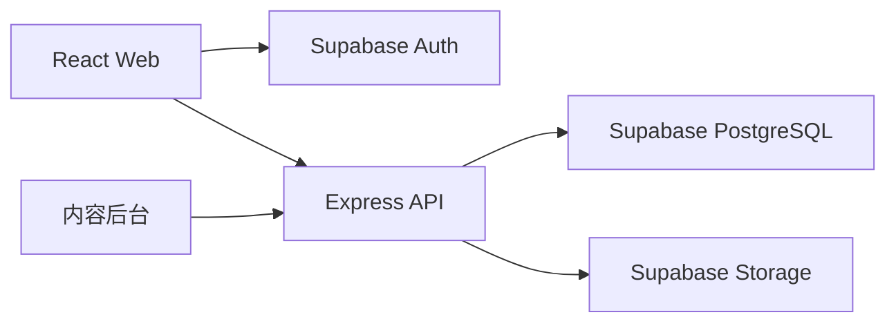

# AquaGuide 三层数据契约

> 版本：2.7.0
> 状态：已确认，实施中
> 生效日期：2026-08-21
> SQL 来源：`supabase/migrations/202607160001_core_schema.sql` 至 `supabase/migrations/202608090002_atomic_care_reminder_completion.sql`
> TypeScript 来源：`src/types/database.ts`

## 1. 产品与架构边界

AquaGuide 面向水族新手，提供鱼缸管理、物种选择、混养判断、巡检、养护补救和个人水族册。

正式架构：



- 前端仅使用 Supabase Auth 获取会话，不直接读写业务表。
- 登录用户的业务数据以 PostgreSQL 为唯一事实来源。
- 游客继续使用本地 Repository；登录后先预览并确认迁移。
- 混养、巡检、今日行动和成就由确定性规则派生，AI 不能覆盖规则结论。
- AI 原始回复和巡检自由描述默认不持久化。
- 数据库使用 `snake_case`；API、共享类型和前端统一使用 `camelCase`，转换只发生在 API 层。
- 中文主数据继续作为确定性规则的稳定输入；本地化只改变展示文本，不改变规则结论。
- 侧栏与页头的任务入口只能进入正式路由或可定位模块，不得由导航直接打开业务弹窗。
- 缸内体态属于养护与诊断上下文，不得改变混养四态结论。
- 现实中已经存在的缸内生物属于事实记录；混养结论只能生成保存后的风险提示，不能阻止事实写入。未来规划仍受四态添加策略约束。

### 1.1 任务式路由

- `/search?q=`：统一搜索物种与养护指南。
- `/identify`：拍照识别与手动物种确认。
- `/settings`：语言与已上线设置。
- `/welcome`：首次使用目标选择。

深链接必须定位、高亮并聚焦目标；目标不存在时显示可见错误，不得静默失败。

### 1.2 新手引导状态

`OnboardingState` 保存在现有 `LocalAppState` 中；登录用户同步到 `profiles.preferences`，不新增独立存储键或数据表。仅在没有引导状态、鱼缸、收藏和记录时自动进入 `/welcome`。

两条起步路线均必须完成一次与真实鱼缸关联的完整混养判断。完整计算会在现有 `LocalAppState.compatibilityRecords` 中保存 `{ aquariumId, speciesIds, status, scope: 'tank', evaluatedAt }`；Mini 判断、收藏或直接加入物种不能替代此步骤。建缸路线的第四步是每日巡检，浏览路线的第四步是完整混养判断。

```ts
type OnboardingGoal = 'build_tank' | 'browse_species';
interface OnboardingState {
  version: 1;
  status: 'pending' | 'completed' | 'skipped';
  goal?: OnboardingGoal;
  viewedSpecies: boolean;
  taskCardDismissed: boolean;
  completedAt?: string;
}
```

### 2.1 语言与回退

```ts
type SupportedLocale = 'zh-CN' | 'en';

interface LocalizedContentMeta {
  requestedLocale: SupportedLocale;
  resolvedLocale: SupportedLocale;
  usedFallback: boolean;
}
```

- 首次访问按浏览器语言选择，用户主动选择后保存为 `LocalePreference`。
- 内容接口必须显式接收 `locale`，并在响应中返回 `LocalizedContentMeta`。
- 英文翻译不存在或未发布时安全回退中文，并将 `usedFallback` 设为 `true`。
- 英文入口正式开放前，物种、喂养资料、养护文章和步骤的已发布覆盖率必须为 100%。

## 2. 通用约束

所有业务实体使用 UUID 主键。内容同时保留唯一 `catalog_key`，兼容现有字符串物种和文章 ID。

所有可变表包含：

```ts
interface SyncFields {
  createdAt: string;
  updatedAt: string;
  deletedAt?: string;
  version: number;
}
```

- `createdAt / updatedAt / deletedAt` 为 ISO 8601 时间字符串。
- `version` 从 1 开始，每次更新由数据库触发器递增。
- 更新请求必须提交当前版本；不一致返回 `409 VERSION_CONFLICT`。
- 写接口必须提交 `Idempotency-Key`；同一键重复提交不得产生重复数据。
- 删除默认使用 `deletedAt`；账号删除、鱼缸删除等明确生命周期操作按外键策略级联。

## 3. 内容实体

### 3.1 SpeciesRecord

物种包含 UUID、`catalogKey`、中英文名、分类、难度、温度/pH 文本与可计算范围、换水周期、描述、食性、缸体要求、性情、体型、混养说明、检索词和发布状态。

发布状态：

```ts
type ContentStatus = 'draft' | 'published' | 'archived';
```

只有 `published` 且未删除内容可被普通用户读取。

### 3.2 SpeciesFeedingProfileRecord

每个物种最多一条喂食画像，包含食性、食物、频率、分量规则、活动水层、禁忌、资料来源、可信度和待复核状态。

### 3.3 SpeciesAssetRecord

```ts
type AssetVariant =
  | 'original'
  | 'thumbnail'
  | 'detail'
  | 'texture'
  | 'article_main'
  | 'article_step';
```

物种素材保存 Storage 桶、路径、格式、尺寸、字节数、SHA-256、资源版本和当前版本状态。同一物种、同一用途只能有一个当前资源。

### 3.4 CareArticleRecord

养护文章包含 UUID、`catalogKey`、标题、分类、紧急度、摘要、症状、禁止动作、观察项、诊断时机、下一步、关键词与发布状态。

### 3.5 CareArticleStepRecord / CareArticleAssetRecord

- 操作步骤按文章内 `position` 唯一排序。
- 步骤可包含时间说明、动词式 `actionTitle` 和稳定 `actionKind`（`immediate / avoid / observe / recheck`）。
- 文章素材支持主图和步骤图，同一文章或步骤的同一用途只能有一个当前资源。

### 3.6 证据来源、混养审核与养护引用

```ts
interface CompatibilityEvidence {
  basis: 'species_trait' | 'pair_rule' | 'tank_condition' | 'rule_inference';
  confidence: 'high' | 'medium' | 'low' | 'unknown';
  reviewStatus: 'draft' | 'reviewed' | 'rejected';
  affectedSpeciesIds: string[];
  citations: EvidenceSource[];
}

interface CareActionEvidence {
  id: string;
  kind: 'immediate' | 'avoid' | 'observe' | 'recheck' | 'next';
  text: string;
  supportSummary: string;
  reviewStatus: 'draft' | 'reviewed';
  citations: EvidenceSource[];
}
```

- `evidence_sources` 保存权威来源、机构、URL、来源类型和人工审核状态；搜索结果页不能作为正式来源。
- `species_compatibility_profiles` 保存物种行为特征、最低群体数量、明确捕食目标、可信度和审核状态。
- `species_pair_compatibility_rules` 只保存有明确依据的高频或特殊组合，不穷举全部物种组合。
- 未审核且会影响结论的数据必须降级为 `insufficient_data`；`Aggressive` 不能直接推导 `predatory`。
- `care_article_reference_links` 必须把来源绑定到每个立即动作、禁止动作、观察项、复查动作和唯一下一步，并保存该来源直接支持的动作摘要；文章级泛化来源不能替代逐动作审核。
- 关键词或文章主题只能生成候选来源，不能授予 `reviewed`。动作只有在显式审核登记中同时记录审核人、审核时间和被核对的来源 ID 后才可显示为已审核；未登记动作一律保持 `draft`。
- 普通用户只能读取已审核证据；草稿、驳回与审核写入仅管理员可执行。

### 3.7 翻译实体

新增四张翻译表，不复制中文主数据：

- `species_translations`
- `species_feeding_profile_translations`
- `care_article_translations`
- `care_article_step_translations`

每条翻译包含父实体、`locale`、发布状态、审核人、审核时间和通用同步字段。父实体与语言唯一。普通用户只有在父内容与翻译均为 `published` 时才能读取；草稿、审核和发布仅管理员可操作。

## 4. 用户业务实体

### 4.1 Profile / UserRoleRecord

- `profiles` 保存昵称和非敏感偏好，不复制认证凭据。
- `profiles.preferences` 可保存 `locale` 与 `onboarding`；新设备仅在本地没有选择时读取云端引导状态，本地操作失败同步时不得阻断游客使用。
- `user_roles` 保存 `user | admin`，普通用户不能修改自己的角色。

### 4.2 AquariumWithRelations

鱼缸拆分为：

- `aquariums`：用户、名称、水体、长宽高、目标温度、最近换水与困水时间。
- `aquarium_species`：物种、兼容 `speciesCatalogKey`、数量、入缸日期。
- `aquarium_equipment`：过滤、加热、增氧、灯光；每缸最多一条。
- `aquarium_components`：底砂、水草和硬景。

同一鱼缸内同一 `speciesCatalogKey` 只能保留一条有效记录，追加数量通过更新完成。

鱼缸创建时只保存名称、真实建缸日期和来源。尺寸、水体、目标温度、设备、底砂与换水日期在用户未提供时必须保持空值；UI 示例值不得进入持久化对象。`aquarium_species.last_water_change_at` 继续允许为空，入缸日期不得作为换水日期回填。

鱼缸资料状态由前端领域服务派生，不新增数据库字段：

```ts
type AquariumSetupStatus = 'empty' | 'incomplete' | 'usable' | 'complete';
```

- `empty`：无配置、无生物。
- `incomplete`：已有部分事实或生物，但缺少完整尺寸或水体类型。
- `usable`：完整尺寸与水体类型均已记录。
- `complete`：在 `usable` 基础上确认目标温度与过滤状态。

### 4.3 DiagnosisRecordRow

保存结构化答案、本地规则结论、风险、行动、禁止动作、观察项、缺失信息与复查时间。约束：

- 同一用户的 `diagnosisKey` 唯一。
- 同一鱼缸、同一自然日最多一条 `problemType = "巡检"` 的有效记录。
- AI 原始回复和自由描述原文不得写入本表。

### 4.4 收藏、纪念和养护

- `species_favorites`：用户与物种唯一。
- `care_favorites`：用户与文章唯一。
- `memorial_records`：用户、可选鱼缸、可选物种 UUID、兼容物种键、日期、受控可能原因、其他原因、当时观察和后续改进。
- `care_reminders`：用户、可选鱼缸、来源文章、计划日期、完成时间和可选 1–90 天应用内循环；循环计划必须同时具有 `seriesId` 与 `repeatIntervalDays`。
- `care_events`：建缸、设置、生物加入/移出、体态、换水、喂食、巡检和清单/计划完成事件。
- 事件可通过 `sourceType + sourceId` 关联原始记录；同一来源事件必须幂等。旧记录回填使用 `isInferred = true`，不得伪造历史设置变更。
- 同一文章、同一鱼缸只能有一条未完成养护计划。

### 4.5 MigrationBatchRecord

迁移批次包含用户、幂等键、本地版本、状态、预览摘要、结果摘要、错误摘要和提交时间。

状态：

```ts
type MigrationStatus = 'previewed' | 'committing' | 'completed' | 'failed';
```

### 4.6 FeedbackSubmissionRecord

意见反馈是独立的低敏感用户输入，不绑定鱼缸资料：

```ts
type FeedbackCategory = 'suggestion' | 'problem' | 'content' | 'other';
type FeedbackStatus = 'new' | 'reviewed' | 'closed';
type FeedbackEmailDeliveryStatus = 'not_configured' | 'sent' | 'failed';

interface FeedbackSubmissionRecord {
  id: string;
  ownerId?: string;
  category: FeedbackCategory;
  message: string;
  pagePath: string;
  locale: SupportedLocale;
  appVersion: string;
  deviceLayout: 'phone' | 'desktop';
  status: FeedbackStatus;
  emailDeliveryStatus: FeedbackEmailDeliveryStatus;
  emailDeliveryId?: string;
  emailDeliveryError?: string;
  emailedAt?: string;
  createdAt: string;
  updatedAt: string;
  deletedAt?: string;
  version: number;
}
```

- 游客和登录用户均通过 Express 提交；前端不得直接写表。
- `message` 长度为 10–2000，禁止附带照片、联系方式、鱼缸参数或症状原文。
- 普通用户不能查询、更新或删除反馈；管理员可读取并更新处理状态。
- 单实例 API 使用有界、代理感知的进程内限流；直连环境默认不信任转发头，部署在单层可信代理后必须设置 `TRUST_PROXY_HOPS=1`。多实例生产部署还必须在入口网关配置共享限流，不能依赖单个进程形成全局额度。
- API 日志不记录反馈正文、原始 IP 或认证令牌。
- Express 先写入数据库，再尝试调用邮件服务；邮件失败不得回滚已保存反馈。服务端使用反馈 ID 作为邮件幂等键，收件地址、发件地址和密钥只来自部署 Secret。

### 4.6.1 生命纪念原因

```ts
type MemorialCauseCode =
  | 'water_quality_change'
  | 'oxygen_shortage'
  | 'temperature_stress'
  | 'acclimation_stress'
  | 'aggression_or_injury'
  | 'feeding_or_digestive'
  | 'suspected_illness'
  | 'recent_medication_or_change'
  | 'age_related'
  | 'unknown'
  | 'other';
```

- `causeCodes` 最多五项；`unknown` 必须单独选择。
- `reason` 继续保存“其他原因”的用户补充，并兼容旧自由文本记录。
- 原因标签只表达可能性，不作为疾病确诊、健康评分或混养结论输入。

### 4.7 IdempotencyRecord

后端为写请求保存用户、幂等键、请求方法、路径、请求哈希、资源引用、响应状态和过期时间。同一用户的幂等键唯一；相同键但请求哈希不同必须返回 `409 DUPLICATE_RESOURCE`，不能复用旧结果。

### 4.8 SpeciesRecognitionMissRecord

拍照识别未命中只保存匿名聚合元数据：图片 SHA-256 指纹、视觉模型名称与版本、候选标签、候选内容键、出现次数和可选的最终确认内容键。

- 不保存原图、EXIF、用户身份、鱼缸资料或症状原文。
- 相同指纹、模型和模型版本只保留一条记录并累加次数。
- 普通用户不能直接查询；仅后端 `service_role` 可聚合写入和补充最终确认结果。
- Supabase 未配置时仅保留当前会话状态，界面必须明确显示“云端未记录”。

## 5. RLS 与 Storage

### 5.1 数据库策略

| 资源 | Select | Insert / Update / Delete |
|---|---|---|
| 已发布物种、文章及其公开素材记录 | 所有人 | 管理员 |
| 草稿与下线内容 | 管理员 | 管理员 |
| `profiles` | 本人 | 本人 |
| `user_roles` | 本人或管理员 | 管理员 |
| 鱼缸和所有鱼缸子数据 | 所有者 | 所有者 |
| 巡检、收藏、纪念、养护与迁移 | 所有者 | 所有者 |
| 已发布翻译且父内容已发布 | 所有人 | 管理员 |
| `species_recognition_misses` | 无客户端权限 | 后端 `service_role` |
| `feedback_submissions` | 无客户端权限 | 后端受控写入；管理员只读与更新状态 |

所有鱼缸子表都通过鱼缸外键再次验证 `aquariums.owner_id = auth.uid()`，不能只相信请求中的用户 ID。

### 5.2 Storage

- `catalog-originals`：私有原图，只有管理员可读写。
- `catalog-public`：公开衍生图，所有人可读、只有管理员可写。
- 单文件原图上限 20MB，公开衍生图上限 10MB。
- 允许 PNG、JPEG 和 WebP。
- 正式路径包含内容键、资源版本与用途，禁止覆盖同一路径伪装成新版本。

## 6. API 通用协议

基础路径：`/api/v1`。

```ts
interface ApiSuccess<T> {
  data: T;
  requestId: string;
}

interface ApiFailure {
  error: {
    code: ApiErrorCode;
    message: string;
    details?: unknown;
  };
  requestId: string;
}

type ApiErrorCode =
  | 'VALIDATION_ERROR'
  | 'AUTH_REQUIRED'
  | 'FORBIDDEN'
  | 'NOT_FOUND'
  | 'VERSION_CONFLICT'
  | 'DUPLICATE_RESOURCE'
  | 'PAYLOAD_TOO_LARGE'
  | 'MIGRATION_REJECTED'
  | 'RATE_LIMITED'
  | 'INTERNAL_ERROR'
  | 'DEPENDENCY_UNAVAILABLE';
```

分页使用 `cursor` 和 `limit`，响应返回 `items` 与可选 `nextCursor`。默认 24，最大 100。

## 7. API 列表

### 7.1 内容

| Method | Path | Request | Response | 主要错误 |
|---|---|---|---|---|
| GET | `/species` | `locale cursor? limit? category? query?` | `Page<SpeciesSummary>` | 400/503 |
| GET | `/species/:catalogKey` | `locale` | `SpeciesWithRelations` | 404/503 |
| GET | `/care-articles` | `locale cursor? limit? category? urgency? query?` | `Page<CareArticleSummary>` | 400/503 |
| GET | `/care-articles/:catalogKey` | `locale` | `CareArticleWithRelations` | 404/503 |

普通内容接口只返回已发布内容。管理员内容列表通过 `/admin` 接口读取草稿和下线内容。

### 7.2 鱼缸

| Method | Path | Request | Response | 主要错误 |
|---|---|---|---|---|
| GET | `/aquariums` | 无 | `AquariumWithRelations[]` | 401/503 |
| POST | `/aquariums` | 鱼缸字段，Header 幂等键 | `AquariumWithRelations` | 400/401/409 |
| GET | `/aquariums/:id` | 路径参数 | `AquariumWithRelations` | 401/403/404 |
| PATCH | `/aquariums/:id` | 可变字段、`version` | `AquariumWithRelations` | 400/401/404/409 |
| DELETE | `/aquariums/:id` | `version` | `{ deleted: true }` | 401/404/409 |
| POST | `/aquariums/:id/species` | 物种键、数量、日期、初始体态、幂等键 | `AquariumSpeciesRecord` | 400/401/404/409 |
| PATCH | `/aquariums/:id/species/:recordId` | 日期、`version`；数量仅允许单批次兼容更新 | `AquariumSpeciesRecord` | 400/401/404/409 |
| DELETE | `/aquariums/:id/species/:recordId` | `version` | `{ deleted: true }` | 401/404/409 |
| POST | `/aquariums/:id/species/:recordId/batches` | 数量、入缸日期、生长阶段、繁殖状态、幂等键 | `AquariumSpeciesBatchRecord` | 400/401/404/409 |
| PATCH | `/aquariums/:id/species/:recordId/batches/:batchId` | 可变字段、`version` | `AquariumSpeciesBatchRecord` | 400/401/404/409 |
| POST | `/aquariums/:id/species/:recordId/batches/:batchId/split` | 拆分数量、新体态、`sourceVersion`、幂等键 | `AquariumSpeciesBatchRecord[]` | 400/401/404/409 |
| POST | `/aquariums/:id/species/:recordId/batches/:batchId/merge` | 来源批次、最终入缸日期/生长阶段/繁殖状态、双方版本 | `AquariumSpeciesBatchRecord[]` | 400/401/404/409 |
| POST | `/aquariums/:id/species/:recordId/batches/:batchId/remove` | 正整数数量、`Idempotency-Key` | `AquariumRecord` | 400/401/404/409 |
| POST | `/aquariums/:id/species/:recordId/batches/:batchId/memorial` | 日期、受控原因、其他原因、观察、后续改进、批次版本、幂等键 | `MemorialRecord` | 400/401/404/409 |
| DELETE | `/aquariums/:id/species/:recordId/batches/:batchId` | `version` | `{ deleted: true, speciesRemoved: boolean }` | 401/404/409 |
| PUT | `/aquariums/:id/equipment` | 设备字段、可选 `version` | `AquariumEquipmentRecord` | 400/401/404/409 |
| POST | `/aquariums/:id/components` | 类型、名称、数量、幂等键 | `AquariumComponentRecord` | 400/401/404/409 |
| PATCH | `/aquariums/:id/components/:componentId` | 可变字段、`version` | `AquariumComponentRecord` | 400/401/404/409 |
| DELETE | `/aquariums/:id/components/:componentId` | `version` | `{ deleted: true }` | 401/404/409 |

物种写入分为两种 Intent：`record_existing` 先保存事实再评估，四态均不得阻止保存；`planned_addition` 先评估，继续使用 `allow / confirm / complete_information / block`。规划阶段不写入缸内物种，只有用户明确确认已经实际入缸后才切换为事实记录。

### 7.2.1 缸内物种批次

`aquarium_species` 继续作为同缸同物种的汇总记录，`aquarium_species_batches` 记录同一物种内的数量、入缸日期和体态差异。
新增现实生物必须调用数据库函数 `add_aquarium_livestock`，在同一事务内创建或复用父物种、写入批次并登记幂等结果；批次或幂等登记失败时不得留下 active 父记录，相同操作号重放只能得到一个父记录和一个批次。
批次拆分必须调用数据库函数 `split_aquarium_species_batch`，在同一事务内减少来源批次数量并创建新批次；任一步失败时总数量保持不变，同一幂等键重放返回同一拆分结果。
批次合并必须调用 `merge_aquarium_species_batches`，在同一事务内写入用户确认的最终体态并合并两组，合并前后总数量保持不变；最终体态使用数据库 enum 参数，不经不安全的文本隐式转换。
现实移出必须调用 `remove_aquarium_species_batch_quantity`，在同一数据库事务内锁定批次、扣减或软删除，并写入幂等记录；相同操作号和请求重放只能返回当前鱼缸，不能再次扣减。移出数量在界面、Repository、API 与数据库四层都必须为正整数。
从缸内物种记录生命纪念必须调用 `record_livestock_memorial`，在同一事务内写入纪念并扣减所选批次；任一步失败时两边都不得产生部分结果。相同幂等键重放必须先返回已提交纪念，再检查可能已被软删除的父物种记录。

完成循环养护必须调用 `complete_care_reminder_with_recurrence`，在同一数据库事务内完成当前计划、创建唯一下一期并登记幂等结果；响应丢失或并发重放不得重复生成下一期，也不得留下“当前已完成但下一期缺失”的半完成状态。

```ts
type LifeStage = 'unknown' | 'juvenile' | 'adult';
type ReproductiveState =
  | 'unknown'
  | 'not_applicable'
  | 'normal'
  | 'pregnant_or_gravid'
  | 'in_labor_or_spawning'
  | 'postpartum_recovery';

interface AquariumSpeciesBatchRecord extends SyncFields {
  id: string;
  aquariumSpeciesId: string;
  quantity: number;
  entryDate: string;
  lifeStage: LifeStage;
  reproductiveState: ReproductiveState;
  stateUpdatedAt: string;
}
```

- 旧 `aquarium_species` 每条回填一个“未知阶段 / 未知繁殖状态”默认批次，回填前后汇总数量必须相同。
- 父记录 `quantity` 由未删除批次的数量之和派生，不允许多批次时直接覆盖。
- 删除最后一个批次会软删除父物种记录；界面必须二次确认。
- 怀孕/抱卵、生产/繁殖和产后恢复为用户确认的短期状态，AI 只能建议确认，不能自动写入。
- 水草、硬景等不适用繁殖体态的内容使用 `not_applicable`。

### 7.3 巡检、收藏、纪念和养护

| Method | Path | Request | Response | 主要错误 |
|---|---|---|---|---|
| GET | `/aquariums/:id/daily-checks/:localDate` | 日期 | `DiagnosisRecordRow | null` | 400/401/404 |
| PUT | `/aquariums/:id/daily-checks/:localDate` | 结构化规则结果、幂等键、可选版本 | `DiagnosisRecordRow` | 400/401/409 |
| GET | `/favorites/species` | 无 | `SpeciesFavoriteRecord[]` | 401 |
| PUT | `/favorites/species/:speciesId` | Header 幂等键 | `SpeciesFavoriteRecord` | 401/404/409 |
| DELETE | `/favorites/species/:speciesId` | 可选版本 | `{ deleted: true }` | 401/404/409 |
| GET | `/favorites/care` | 无 | `CareFavoriteRecord[]` | 401 |
| PUT | `/favorites/care/:articleId` | Header 幂等键 | `CareFavoriteRecord` | 401/404/409 |
| DELETE | `/favorites/care/:articleId` | 可选版本 | `{ deleted: true }` | 401/404/409 |
| GET | `/memorial-records` | `cursor? limit?` | `Page<MemorialRecordRow>` | 401 |
| POST | `/memorial-records` | 物种、日期、受控原因、其他原因、观察、后续改进、幂等键 | `MemorialRecordRow` | 400/401/409 |
| PATCH | `/memorial-records/:id` | 日期、受控原因、其他原因、观察、后续改进、`version` | `MemorialRecordRow` | 400/401/404/409 |
| DELETE | `/memorial-records/:id` | `version` | `{ deleted: true }` | 401/404/409 |
| GET | `/care-reminders` | `status? aquariumId?` | `CareReminderRecordRow[]` | 401 |
| POST | `/care-reminders` | 来源、时间、幂等键 | `CareReminderRecordRow` | 400/401/409 |
| PATCH | `/care-reminders/:id` | 时间、完成状态、循环设置、`version`、稳定幂等键 | `CareReminderRecordRow` | 400/401/404/409 |
| DELETE | `/care-reminders/:id` | `version` | `{ deleted: true }` | 401/404/409 |
| GET | `/care-events` | `aquariumId? type? cursor? limit?` | `Page<CareEventRecord>` | 401 |
| POST | `/care-events` | 类型、时间、内容、稳定来源、幂等键 | `CareEventRecord` | 400/401/409 |
| DELETE | `/care-events/by-source` | 鱼缸、来源类型、来源 ID、稳定幂等键 | `{ deleted: true }` | 400/401/409 |

### 7.3.1 意见反馈

| Method | Path | Request | Response | 主要错误 |
|---|---|---|---|---|
| POST | `/feedback` | `category message pagePath locale appVersion deviceLayout` | `{ id, status, emailDeliveryStatus, createdAt }` | 400/429/503 |
| GET | `/admin/feedback` | `status? cursor? limit?` | `Page<FeedbackSubmissionRecord>` | 401/403/503 |
| PATCH | `/admin/feedback/:id/status` | `status` | `FeedbackSubmissionRecord` | 400/401/403/404/409 |

### 7.4 启动、迁移与管理

本节路径均位于 `/api/v1`；用户资料的完整地址为 `/api/v1/profile`。

| Method | Path | Request | Response | 主要错误 |
|---|---|---|---|---|
| GET | `/bootstrap` | 无 | 用户、角色、鱼缸摘要、收藏和同步状态 | 401/503 |
| GET | `/profile` | 无 | 当前用户资料与语言偏好 | 401/404 |
| PATCH | `/profile` | `locale version` | 更新后的用户资料 | 400/401/409 |
| POST | `/migrations/preview` | 本地导出数据与版本 | `MigrationBatchRecord` | 400/401/413/422 |
| POST | `/migrations/commit` | 批次 ID、确认项、幂等键 | `MigrationBatchRecord` | 400/401/409/422 |
| GET | `/migrations/:id` | 路径参数 | `MigrationBatchRecord` | 401/404 |
| GET/POST/PATCH | `/admin/species` | 管理员内容字段 | 内容记录 | 400/401/403/409 |
| GET/POST/PATCH | `/admin/care-articles` | 管理员内容字段 | 内容记录 | 400/401/403/409 |
| POST | `/admin/assets` | 图片、用途、内容 ID | `SpeciesAssetRecord | CareArticleAssetRecord` | 400/401/403/413 |
| POST | `/admin/content/:type/:id/publish` | `version` | 更新后的内容 | 401/403/404/409 |
| POST | `/admin/content/:type/:id/archive` | `version` | 更新后的内容 | 401/403/404/409 |
| GET | `/admin/translations/coverage` | `locale` | `TranslationCoverageDto` | 400/401/403 |
| GET/PATCH | `/admin/translations/:contentType/:contentId` | `locale`、翻译字段与版本 | 翻译草稿 | 400/401/403/404/409 |
| POST | `/admin/translations/:translationId/publish` | `version` | 已审核翻译 | 401/403/404/409 |

现有 `/api/health` 和 `/api/ai/chat` 保留兼容；新增 `/api/v1/health` 与 `/api/v1/ai/chat` 别名。
AI 请求增加 `locale`，只控制输出语言；混养、巡检、今日行动和成就结论仍由共享规则决定。

`GET /api/health` 与 `GET /api/v1/health` 同时返回文本和视觉能力，且绝不返回密钥：

```ts
interface AiCapabilityStatus {
  text: { configured: boolean; provider: string; model: string };
  vision: { configured: boolean; mode: 'model' | 'manual_confirmation' };
}
```

旧的 `configured / provider / aiProvider / model` 字段继续保留，仅代表文字 AI，保证现有客户端兼容。视觉未配置时，识图入口必须明确为手动物种确认模式。

### 7.5 物种识别与状态判断

| Method | Path | Request | Response | 主要错误 |
|---|---|---|---|---|
| POST | `/ai/species-recognition` | JPEG/PNG/WebP 原始图片，最大 10MB | `SpeciesRecognitionResult` | 400/413/429/503 |
| POST | `/ai/species-recognition/misses` | 匿名指纹、模型与候选元数据 | `{ persisted, missId? }` | 400/503 |
| PATCH | `/ai/species-recognition/misses/:id/resolve` | `resolvedCatalogKey` | `{ persisted, missId? }` | 400/404/503 |
| POST | `/ai/species-diagnosis/step` | `SpeciesDiagnosisStepInput` | `SpeciesDiagnosisStepOutput` | 400/429/503 |

视觉识别使用独立的 `VISION_API_KEY / VISION_BASE_URL / VISION_MODEL / VISION_TIMEOUT_MS`。图片只在内存中去除 EXIF 并缩放到最长边 1536px，推理后立即释放，不写入 Storage。确认物种后先进入独立识别结果；用户可查看资料或结合当前鱼缸做混养判断，只有主动选择“健康分诊”后才进入症状描述与动态追问。非鱼类可识别和查看资料，但第一版不开放健康分诊。

状态判断的职责边界：

- AI 只把自然语言映射到受控观察代码；本地规则决定紧急等级、追问顺序、原因排序和安全动作。
- 每次只显示一个确定性问题，最多追问三次；红旗问题优先，其余按剩余原因的信息增益选择。
- 结果只显示“更可能 / 可能 / 暂不能排除”，不显示未校准百分比，不做疾病确诊或自动用药建议。
- AI 不得降低本地紧急等级、增加规则外疾病或扩展养护文章白名单。
- 症状自由文本和 AI 原始回复不持久化；用户明确保存时只保存结构化观察和受规则约束的结果。

## 8. Repository 契约

前端页面只能通过 Repository 操作业务数据：

```ts
interface AquaGuideRepository {
  getAquariums(): Promise<AquariumWithRelations[]>;
  createAquarium(input: AquariumCreateCommand): Promise<AquariumWithRelations>;
  addLivestock(input: LivestockAddCommand): Promise<AquariumWithRelations>;
  saveAquarium(input: AquariumSaveInput): Promise<AquariumWithRelations>;
  removeLivestock(input: LivestockRemovalInput): Promise<AquariumWithRelations>;
  updateFavorite(input: FavoriteMutation): Promise<void>;
  saveDiagnosis(input: DiagnosisSaveInput): Promise<DiagnosisRecordRow>;
  saveMemorial(input: MemorialSaveInput): Promise<MemorialRecordRow>;
  updateCareReminder(input: CareReminderMutation): Promise<CareReminderRecordRow>;
}

interface AquariumCreateCommand {
  name: string;
  startedAt: string;
  startedAtSource: 'created';
  operationId: string;
}

interface LivestockAddCommand {
  aquariumId: string;
  speciesCatalogKey: string;
  quantity: number;
  entryDate: string;
  lifeStage?: LifeStage;
  reproductiveState?: ReproductiveState;
  operationId: string;
}
```

```ts
interface LivestockRemovalInput {
  aquariumId: string;
  aquariumFishId: string;
  batchId: string;
  quantity: number;
  operationId: string;
}

type WaterProfileTendency = 'acidic' | 'neutral' | 'alkaline' | 'marine' | 'unknown';

interface WaterProfileEstimate {
  tendency: WaterProfileTendency;
  confidence: 'low' | 'medium';
  evidence: string[];
  limitation: string;
}
```

- 移出表示现实中已转移、送养或退回的数量，不创建生命纪念。
- 部分移出只减少所选批次；移出最后一个批次时软删除父物种记录。
- 前端必须显示移出数量、来源批次与物种名称，并在二次确认后写入。
- `WaterProfileEstimate` 只根据水体、底砂和硬景给出趋势；水草只可作为弱证据，不得推断数值 pH。
- 缺少 pH 不得阻断普通耐受物种的基础判断；仅在敏感物种或明确区间冲突时提示进一步检测。

- `LocalAquaGuideRepository` 兼容现有游客存储键。
- `ApiAquaGuideRepository` 只调用 Express API。
- 登录状态选择 Repository，页面不判断具体数据来源。
- 云端模式断网时读本地缓存，写操作进入 IndexedDB outbox；恢复后按幂等键重放。

## 9. 本地迁移规则

1. 登录后读取并校验当前主状态与兼容键。
2. 先生成只读预览：实体数量、重复项、损坏项和未知内容键。
3. 用户确认后提交唯一迁移批次。
4. 后端按唯一键和幂等键写入并回读核对。
5. 成功后切换云端 Repository；原数据至少保留 30 天。
6. 迁移失败不得修改或删除原本地数据。

冲突处理：

- 收藏合并集合；取消收藏使用 `deletedAt` 防止旧设备复活。
- 鱼缸字段冲突返回本机/云端摘要，由用户选择。
- 生物数量按记录 ID 合并，禁止直接相加。
- 同日巡检保留更新时间较新的结构化记录。
- 生命纪念按记录 ID 合并。

## 10. 场景化图鉴与知识旅程展示契约（2.7.0）

互动图鉴、场景化养护入口与传统列表共享现有 `Fish`、`CareTopic`、混养引擎、诊断图和行动证据；首期不新增数据库表、API、存储键或自动诊断结论。

```ts
type KnowledgeObjectId =
  | 'water_surface'
  | 'water_body'
  | 'livestock'
  | 'filter'
  | 'substrate'
  | 'plants_equipment';

type KnowledgeUrgency = 'routine' | 'watch' | 'urgent';

interface KnowledgeJourneyAction {
  id: string;
  title: string;
  instruction: string;
  reviewStatus: 'reviewed' | 'pending';
  sourceIds: string[];
}

interface KnowledgeJourney {
  id: string;
  objectId: KnowledgeObjectId;
  observationCodes: string[];
  urgency: KnowledgeUrgency;
  contextFacts: Array<{ label: string; value: string; status: 'confirmed' | 'unknown' }>;
  emergencyActions: KnowledgeJourneyAction[];
  clarifyingQuestions: Array<{ id: string; prompt: string; options: Array<{ id: string; label: string }> }>;
  possibleCauses: string[];
  avoidActions: KnowledgeJourneyAction[];
  recheck: { timing: string; signals: string[] };
  relatedArticleIds: string[];
}
```

- 所有“现在先做”动作必须来自既有诊断图或文章步骤；不能由展示层创造处理建议。
- 行动来源为 `pending` 时，界面必须明确为“待专项复核”，不得显示为已审核知识。
- 红旗路径先显示低风险应急动作；常规路径最多询问两项已有确定性问题。
- 当前鱼缸字段缺失时应显示“未记录”，不能用示例值或推测值补齐。
- 场景选择、视图模式和步骤进度仅为会话 UI 状态，不写入用户业务数据。

### 10.1 互动图鉴批次状态（2.7.1）

互动图鉴继续复用 `aquapediaDiscoveryDeck`，不新增数据库、API 或独立 localStorage 键。旧的单项每日推荐字段 `queueIds / consumedIds` 保持兼容；场景只读取以下独立批次字段，避免“换一批”误变成跳过一条：

```ts
interface InteractiveDiscoveryBatchState {
  sceneBatchIds: string[]; // 当前屏幕正在展示的 0–6 个物种
  sceneSeenIds: string[]; // 当日已完整替换过的批次集合
  sceneBatchIndex: number;
  sceneComplete: boolean;
}
```

- 首屏与每次替换最多显示 6 个具体物种；替换动作先把整批加入 `sceneSeenIds`，新旧批次交集必须为 0。
- 仅排除已收藏、水草、硬景和没有有效场景图片的条目；可用条目不足 6 个时展示余量。
- 当天全部浏览后保持明确完成状态；只有用户点“重新开始”才清除 `sceneSeenIds`。
- 当前批次、已浏览集合和批次序号会随现有键刷新恢复；它们只用于浏览体验，不参与推荐、混养或收藏业务结论。

## 11. 兼容与排除范围

- 原 `Fish.id`、`CareTopic.id` 迁移为 `catalogKey`。
- 原收藏、纪念、巡检和养护计划存储键继续供游客与迁移读取。
- 原始 PNG 在迁移验证前不删除；Storage 衍生图使用版本化路径。
- 简易后台不包含多人审核、版本历史或复杂 CMS。
- 本期不新增开放式 AI 问答、系统通知、积分、排行或社交能力。

## 12. 历史契约状态

本文件 2.1.0 替代此前“本轮不迁移 Supabase、不新增业务表”的阶段性约束。旧约束只适用于 2026-07-16 前的本地核心体验收口，不再作为云端架构实施依据。

## 13. 鱼缸记录导出与隐私分享（2.4.0）

- `Aquarium` 增加 `startedAt / startedAtSource / startedAtConfirmedAt`；新缸使用创建日，旧缸推算后必须由用户确认，百日纪念只使用已确认日期。
- 六类导出统一为客户端 PNG，只消费现有业务数据，不保存导出图片。
- `aquarium_share_reports` 只保存登录用户主动生成的七天脱敏快照和令牌哈希；公开读取必须经过 Express，前端不得直接读表。
- 分享快照采用字段白名单：健康、环境概况、物种汇总、结构化巡检和本周计划。用户身份、自定义鱼缸名、内部 ID、自由描述、纪念原因和 AI 原始回复禁止进入快照。
- 原始分享令牌不落库；撤销或过期后公开接口不得返回快照。
- 普通用户没有 `aquarium_share_reports` 的 INSERT/UPDATE 权限；创建和撤销都只允许 Express 在验证登录用户与鱼缸归属后通过服务端凭据写入。快照、令牌哈希、鱼缸和失效时间均由后端生成或覆盖，用户不能直写或修改。
- 公开令牌接口的成功与错误响应均使用 `Cache-Control: no-store`，避免撤销后继续命中历史响应。
- 生产环境必须配置 `SHARE_TOKEN_SECRET` 和可信 `WEB_BASE_URL`；开发环境可分别回退服务端密钥与本地站点。

```text
POST   /api/v1/aquariums/:id/share-reports
GET    /api/v1/share-reports
DELETE /api/v1/share-reports/:id
GET    /api/v1/public/share-reports/:token
```
