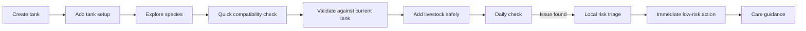
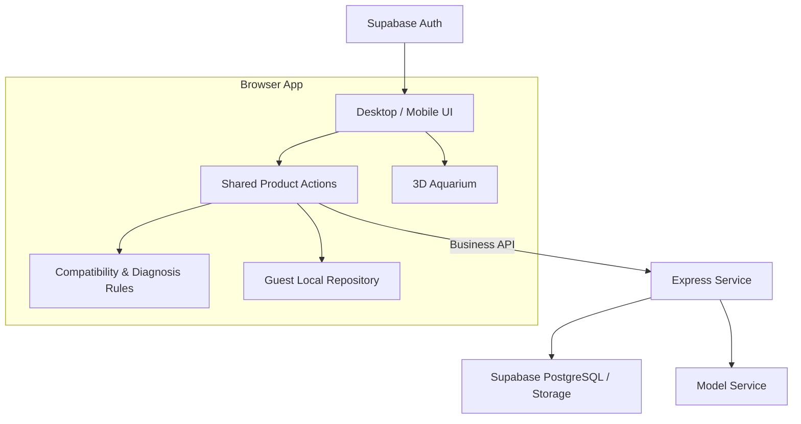

# AquaGuide — AI-Assisted Aquarium Management for Beginner Fishkeepers

AquaGuide is an aquarium management web app for beginner and light-experience fishkeepers. It connects tank setup, species discovery, compatibility checking, daily observations, care guidance, and collection tracking into one workflow.

**Core design principle:** safety-critical conclusions come from deterministic rules. AI explains, organizes, and asks bounded follow-up questions, but does not override compatibility or risk decisions.

> 面向水族新手的鱼缸管理、物种选择、混养判断与养护补救助手。确定性规则负责安全边界，AI 负责解释与辅助。

**At a glance:** Tank management · Species compatibility · Daily checks · Care guidance · Rules-first safety · Bounded AI · Evaluation

[Live demo](https://aqua-tank-guide.vercel.app) · [Product flow](#product-flow) · [AI boundary](#ai-is-not-the-decision-engine) · [Architecture](#architecture) · [Evaluation](#reliability--evaluation)

## Why AquaGuide

Aquarium beginners rarely lack information. The harder problem is that information is fragmented, advice can conflict, and users often do not know what to do next.

AquaGuide turns that scattered decision process into a shorter, traceable workflow.

## Product Flow



## Core Product Modules

| Module | What it does | Status |
| --- | --- | --- |
| **My Aquarium** | Manage tanks, dimensions, equipment, livestock, and tank views | Implemented |
| **Species Atlas** | Search, filter, inspect, and save species | Implemented |
| **Compatibility Engine** | Run species-only checks and tank-aware compatibility checks | Implemented |
| **Daily Check** | Record observations and receive structured local risk triage | Implemented |
| **Care Guide** | Search care topics and follow recovery guidance | Implemented |
| **AI Tank Copilot** | Clarify setup goals and explain bounded options | Implemented |
| **Aquarium Collection** | Aggregate saved species, care records, memorials, and achievements | Implemented |
| **3D Demo** | Experimental aquarium interaction and material work | Internal experiment |
| **Cloud Sync** | Cross-device backup and recovery | In progress |

## AI Is Not the Decision Engine

AquaGuide deliberately separates deterministic product logic from generative AI.

### Deterministic logic handles

- species compatibility and blocking rules;
- structured risk classification;
- safety boundaries and allowed actions;
- care-guide allowlists;
- validation before livestock is written into a tank.

### AI handles

- explaining rule-based conclusions in plain language;
- organizing observations;
- asking bounded follow-up questions;
- helping users understand setup and care options.

If the model is unavailable or returns invalid output, the product keeps the deterministic result rather than weakening a risk decision.

## Architecture



### Main stack

- **Frontend:** React 19, TypeScript, React Router, Vite 6, Tailwind CSS 4
- **3D:** Three.js, React Three Fiber, Drei
- **Service layer:** Express + TypeScript
- **Identity & data:** Supabase Auth, PostgreSQL, Storage
- **Analytics:** PostHog
- **Validation:** TypeScript checks, scripted contract tests, Playwright-based verification

## Reliability & Evaluation

AquaGuide includes an explicit evaluation layer rather than treating model output as automatically correct.

Current evaluation work covers:

- AI Tank Copilot contract and fallback scenarios;
- deterministic Daily Check rules and provider-failure scenarios;
- species status assessment and red-flag priority;
- visual-identification flow and fallback validation;
- separate deterministic, mocked-provider, and opt-in live-provider evaluation paths;
- a **Badcase → Fix → Regression** workflow for traceable failures.

Run the default evaluation suite with:

```bash
npm run eval:all
```

## Local Development

```bash
npm install
npm run dev
```

Build the project with:

```bash
npm run build
```

Useful validation commands:

```bash
npm run lint
npm run test:compatibility
npm run test:ai-entry-policy
npm run test:copilot-contract
npm run test:daily-check
npm run eval:all
```

## Documentation

Start with the [product documentation index](./docs/README.md).

Recommended entry points:

- [PRD](./docs/01-definition/PRD.md)
- [Technical Architecture](./docs/03-development/TECH_ARCHITECTURE.md)
- [AI & API Specification](./docs/02-design/AI_AND_API_SPEC.md)
- [QA & Acceptance](./docs/03-development/QA_ACCEPTANCE.md)
- [AI Evaluation Status](./docs/05-validation/AI_EVALUATION_STATUS.md)
- [Product Gaps & Roadmap](./docs/04-planning/PRODUCT_GAPS_AND_ROADMAP.md)
- [CONTRACT.md](./CONTRACT.md)
- [PROGRESS.md](./PROGRESS.md)

## Current Limitations

- cloud repository and guest-to-account migration are still being introduced in stages;
- real-user coverage for open-ended AI inputs is not yet complete;
- visual identification does not yet have a sufficiently broad real-photo accuracy benchmark;
- 3D first-load performance and low-end-device behavior still need dedicated validation;
- AquaGuide does **not** provide disease diagnosis, automatic medication, or professional veterinary replacement.

## Product Philosophy

The goal is not to make an AI that sounds confident about aquarium care. The goal is to make aquarium decisions **traceable, bounded, and safer to act on** — using rules where the answer must stay stable and AI only where explanation genuinely helps.
