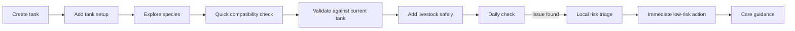
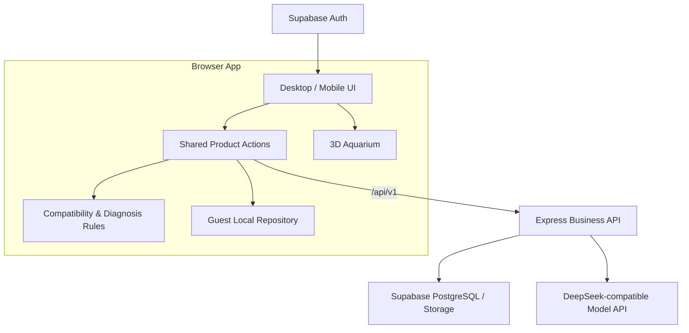

# AquaGuide — AI-Assisted Aquarium Management for Beginner Fishkeepers

AquaGuide is an aquarium management web app for beginner and light-experience fishkeepers. It connects tank setup, species discovery, compatibility checking, daily observations, care guidance, and personal collection tracking into one workflow.

**Core design principle:** safety-critical conclusions come from deterministic rules. AI explains, organizes, and asks follow-up questions, but it does not override compatibility or risk decisions.

> 面向水族新手的鱼缸管理、物种选择、混养判断与养护补救助手。确定性规则负责安全边界，AI 负责解释与辅助。

## Why AquaGuide

Aquarium beginners rarely lack information. The harder problem is that information is fragmented, advice can conflict, and users often do not know what to do next.

AquaGuide is designed to turn that scattered decision process into a short, traceable path:



## Core Product Modules

| Module | What it does | Current status |
| --- | --- | --- |
| **My Aquarium** | Manage multiple tanks, dimensions, equipment, livestock, and 3D tank views | Implemented |
| **Species Atlas** | Search, filter, inspect species details, and save species for later | Implemented |
| **Compatibility Engine** | Run quick species-only checks and full checks against a specific tank | Implemented |
| **Daily Check** | Record structured observations and receive local risk triage | Implemented |
| **Care Guide** | Search care topics, follow recovery steps, and save useful guidance | Implemented |
| **AI Tank Copilot** | Understand setup goals, ask limited follow-up questions, and propose constrained options | Implemented |
| **Aquarium Collection** | Aggregate saved species, care records, memorials, and achievements | Implemented |
| **3D Demo** | Experimental 3D interaction and material work | Internal experiment |
| **Cloud Sync** | Cross-device backup and recovery | Not yet complete |

## AI Is Not the Decision Engine

AquaGuide deliberately separates deterministic product logic from generative AI.

### Deterministic logic handles

- species compatibility and blocking rules;
- structured risk classification;
- safety boundaries and allowed actions;
- article/care-guide allowlists;
- validation before livestock is written into a tank.

### AI handles

- explaining rule-based conclusions in plain language;
- organizing observations;
- asking bounded follow-up questions;
- helping users understand setup and care options.

When the model is unavailable, times out, or returns invalid output, the product is designed to keep the local rule result rather than downgrade risk.

## Architecture



### Main stack

- **Frontend:** React 19, TypeScript, React Router, Vite 6, Tailwind CSS 4
- **3D:** Three.js, React Three Fiber, Drei
- **API:** Express + TypeScript
- **Identity & data:** Supabase Auth, PostgreSQL, Storage
- **AI:** DeepSeek-compatible API behind the server boundary
- **Analytics:** PostHog client integration
- **Validation:** TypeScript checks, scripted contract tests, Playwright-based verification

Guest flows can remain local-first. Authenticated/cloud data paths are being introduced behind the business API and repository boundary rather than letting the UI write directly to privileged services.

## Reliability & Evaluation

AquaGuide includes an explicit evaluation layer rather than treating model output as automatically correct.

Current evaluation work covers:

- **AI Tank Copilot:** 20 programmatic scenarios for contracts, candidate constraints, fallback behavior, and question-count limits;
- **Daily Check:** deterministic rules plus provider-failure scenarios;
- **Species status assessment:** 14 rule/flow scenarios covering red-flag priority and bounded questioning;
- **Visual identification:** flow and fallback validation, with real-image accuracy still awaiting an authorized evaluation set;
- separate deterministic, mocked-provider, and opt-in live-provider evaluation paths;
- a Badcase → Fix → Regression workflow for traceable failures.

Run the default evaluation suite with:

```bash
npm run eval:all
```

Live model evaluation is intentionally opt-in and is not run unless explicitly enabled.

## Local Development

### 1. Install dependencies

```bash
npm install
```

### 2. Configure the model API

Create `.env.local` in the project root:

```bash
DEEPSEEK_API_KEY="your_deepseek_api_key"
DEEPSEEK_BASE_URL="https://api.deepseek.com"
DEEPSEEK_MODEL="deepseek-v4-flash"
API_PORT="8787"
```

For email/password authentication, also configure Supabase public client values:

```bash
VITE_SUPABASE_URL="your_supabase_project_url"
VITE_SUPABASE_ANON_KEY="your_supabase_anon_key"
```

Do **not** expose `SUPABASE_SERVICE_ROLE_KEY` in frontend environment variables or source code.

### 3. Start the app

```bash
npm run dev
```

- Web: `http://localhost:3000`
- API health check: `http://localhost:8787/api/health`

### 4. Build

```bash
npm run build
```

## Useful Validation Commands

```bash
npm run lint
npm run test:compatibility
npm run test:ai-entry-policy
npm run test:copilot-contract
npm run test:daily-check
npm run eval:all
```

The repository contains additional contract and UI verification scripts for taxonomy, onboarding, care flows, responsive behavior, data boundaries, sharing, and business actions.

## Documentation

Start with the [product documentation index](./docs/README.md).

Recommended entry points:

- [PRD](./docs/01-definition/PRD.md) — users, problems, product scope, priorities, and success metrics
- [Technical Architecture](./docs/03-development/TECH_ARCHITECTURE.md) — system boundaries and data flow
- [AI & API Specification](./docs/02-design/AI_AND_API_SPEC.md) — model and API contracts
- [QA & Acceptance](./docs/03-development/QA_ACCEPTANCE.md) — product acceptance criteria
- [AI Evaluation Status](./docs/05-validation/AI_EVALUATION_STATUS.md) — what is and is not currently validated
- [Product Gaps & Roadmap](./docs/04-planning/PRODUCT_GAPS_AND_ROADMAP.md) — known gaps and next-stage work
- [CONTRACT.md](./CONTRACT.md) — code/data contract reference
- [PROGRESS.md](./PROGRESS.md) — current implementation progress

## Current Limitations

- cloud repository, guest-to-account migration, and some business API paths are still being introduced in stages;
- real-user coverage for open-ended AI inputs is not yet complete;
- visual identification does not yet have a sufficiently broad real-photo accuracy benchmark;
- 3D first-load performance and low-end-device behavior still need dedicated validation;
- AquaGuide does **not** provide disease diagnosis, automatic medication, or professional veterinary replacement.

## Product Philosophy

The goal is not to make an AI that sounds confident about aquarium care. The goal is to make aquarium decisions **traceable, bounded, and safer to act on** — using rules where the answer must be stable and AI only where explanation genuinely helps.
