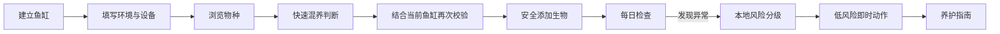
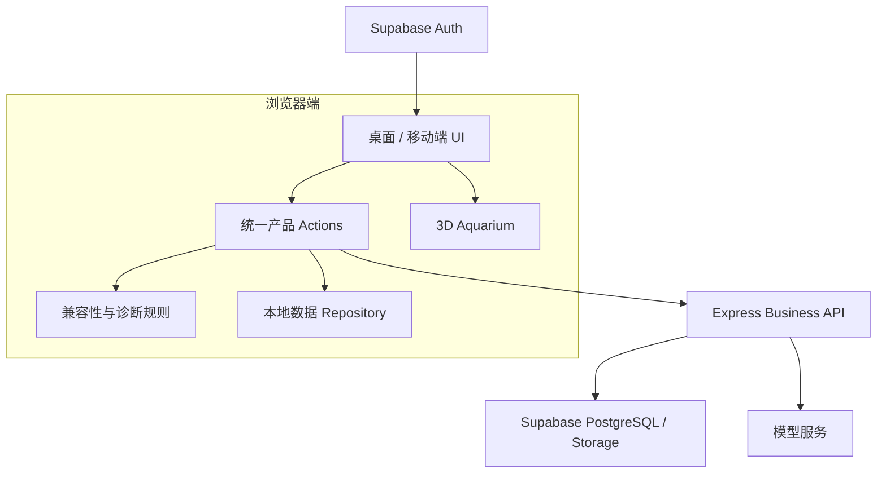
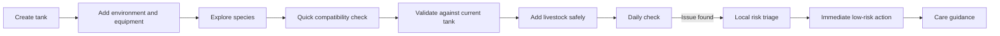
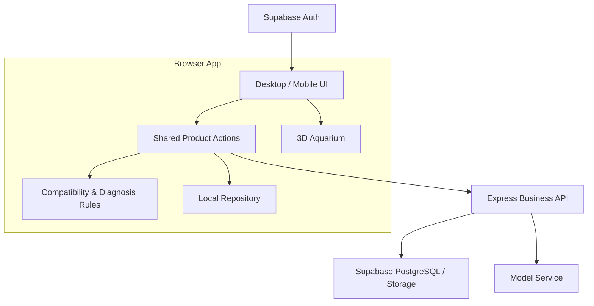

# AquaGuide — AI 辅助水族管理 / AI-Assisted Aquarium Management

**🌐 在线体验 / Website:** [aquaguide.chusday.dpdns.org](https://aquaguide.chusday.dpdns.org)  
**𝕏 X:** [@chu77s](https://x.com/chu77s)

AquaGuide 是面向水族新手的鱼缸管理、物种选择、混养判断与养护辅助工具。

AquaGuide is an aquarium management product for beginner and light-experience fishkeepers.

## 目录 / Table of Contents

### 中文
- [项目简介](#项目简介)
- [为什么做 AquaGuide](#为什么做-aquaguide)
- [核心产品流程](#核心产品流程)
- [核心功能](#核心功能)
- [AI 与确定性规则的边界](#ai-与确定性规则的边界)
- [系统架构](#系统架构)
- [可靠性与评测](#可靠性与评测)
- [本地运行](#本地运行)
- [当前限制](#当前限制)

### English
- [Overview](#overview)
- [Why AquaGuide](#why-aquaguide)
- [Core Product Flow](#core-product-flow)
- [Core Modules](#core-modules)
- [AI vs Deterministic Logic](#ai-vs-deterministic-logic)
- [Architecture](#architecture)
- [Reliability & Evaluation](#reliability--evaluation)
- [Local Development](#local-development)
- [Current Limitations](#current-limitations)

---

# 中文版

## 项目简介

AquaGuide 将鱼缸建立、物种图鉴、混养判断、日常观察、养护建议和个人水族记录串成一个连续产品流程。

**核心设计原则：需要稳定和安全的结论由确定性规则负责，AI 负责解释、整理和有限追问，不覆盖规则给出的风险判断。**

**关键词：** 鱼缸管理 · 物种图鉴 · 混养判断 · 日常检查 · 养护指南 · AI 辅助 · 产品评测

## 为什么做 AquaGuide

水族新手通常并不是完全找不到信息，而是面临三个更实际的问题：

- 信息散落在论坛、商家页面、视频和帖子中；
- 不同来源的建议可能互相冲突；
- 用户知道“哪里不对”，却不知道下一步应该先做什么。

AquaGuide 希望把零散的信息查询转成一个可执行、可追踪的决策流程。

## 核心产品流程



## 核心功能

| 模块 | 作用 | 状态 |
| --- | --- | --- |
| 我的鱼缸 | 管理多个鱼缸、尺寸、设备、生物与 3D 鱼缸视图 | 已实现 |
| 物种图鉴 | 搜索、筛选、查看物种详情并收藏 | 已实现 |
| 混养判断 | 物种间快速判断，并结合具体鱼缸再次校验 | 已实现 |
| 每日检查 | 记录结构化观察并进行本地风险分级 | 已实现 |
| 养护指南 | 按问题查找养护内容与恢复步骤 | 已实现 |
| AI Tank Copilot | 理解用户目标、有限追问并解释可选方案 | 已实现 |
| 水族收藏 | 汇总收藏物种、养护记录、纪念与成就 | 已实现 |
| 3D 实验 | 鱼缸三维展示与材质交互实验 | 实验中 |
| 云端同步 | 跨设备备份与恢复 | 尚未完整实现 |

## AI 与确定性规则的边界

AquaGuide 不把生成式 AI 当作安全决策引擎。

**确定性逻辑负责：**

- 物种兼容性与阻断规则；
- 风险等级判断；
- 安全边界和允许动作；
- 养护内容白名单；
- 生物写入鱼缸前的校验。

**AI 负责：**

- 把规则结论解释成用户容易理解的语言；
- 整理用户输入的观察信息；
- 提出有限数量的追问；
- 帮助用户理解不同养护和配置方案。

即使模型不可用，产品也保留本地规则结果，不因为生成能力失效而降低风险等级。

## 系统架构



主要技术栈：React 19、TypeScript、Vite、Tailwind CSS、Three.js、Express、Supabase、PostHog、Playwright。

## 可靠性与评测

AquaGuide 将“AI 输出是否正确”视为产品能力的一部分，而不是默认模型输出可靠。

当前评测覆盖包括：

- AI Tank Copilot 的输入输出约束、候选限制和 fallback；
- Daily Check 的确定性规则与服务失败场景；
- 物种状态判断中的红旗优先级和追问边界；
- Mock、确定性逻辑和可选真实模型评测路径；
- Badcase → Fix → Regression 的回归流程。

```bash
npm run eval:all
```

## 本地运行

```bash
npm install
npm run dev
```

默认开发环境：

- Web：`http://localhost:3000`
- Business API：`http://localhost:8787`

构建：

```bash
npm run build
```

常用验证命令：

```bash
npm run lint
npm run test:compatibility
npm run test:ai-entry-policy
npm run test:copilot-contract
npm run test:daily-check
npm run eval:all
```

## 当前限制

- 云端 Repository、游客账号迁移和部分业务数据路径仍在迭代；
- 开放式 AI 输入的真实用户覆盖还不充分；
- 图片识别尚缺少足够规模的真实图片准确率评测集；
- 3D 首屏性能和低端设备表现仍需专项验证；
- AquaGuide 不提供疾病诊断、自动用药，也不能替代专业兽医建议。

---

# English Version

## Overview

AquaGuide connects tank setup, species discovery, compatibility checking, daily observations, care guidance, and personal aquarium records into one product workflow.

**Core design principle: deterministic rules own safety-critical decisions. AI explains, organizes, and asks bounded follow-up questions, but does not override compatibility or risk decisions.**

**Keywords:** aquarium management · fishkeeping · species compatibility · daily checks · care guidance · AI assistance · product evaluation

## Why AquaGuide

Beginner fishkeepers rarely suffer from a complete lack of information. The harder problems are fragmentation, conflicting advice, and uncertainty about what to do next.

AquaGuide turns that fragmented research process into a traceable sequence of product decisions.

## Core Product Flow



## Core Modules

| Module | Responsibility | Status |
| --- | --- | --- |
| My Aquarium | Manage tanks, dimensions, equipment, livestock, and 3D views | Implemented |
| Species Atlas | Search, filter, inspect, and save species | Implemented |
| Compatibility Engine | Run quick and tank-specific compatibility checks | Implemented |
| Daily Check | Record structured observations and run local risk triage | Implemented |
| Care Guide | Search care topics and recovery steps | Implemented |
| AI Tank Copilot | Understand goals, ask bounded questions, and explain options | Implemented |
| Aquarium Collection | Aggregate saved species, care records, memorials, and achievements | Implemented |
| 3D Demo | Experimental 3D interaction and materials | Experimental |
| Cloud Sync | Cross-device backup and recovery | Incomplete |

## AI vs Deterministic Logic

Deterministic logic handles compatibility rules, risk classification, safety boundaries, allowlisted care actions, and validation before livestock is added to a tank.

AI is used for explanation, organization, bounded follow-up questions, and helping users understand available setup or care options.

If the model is unavailable, local rule results remain authoritative.

## Architecture



Main stack: React 19, TypeScript, Vite, Tailwind CSS, Three.js, Express, Supabase, PostHog, and Playwright.

## Reliability & Evaluation

Evaluation covers bounded Copilot behavior, deterministic Daily Check rules, species-status red flags, provider-failure scenarios, mock and opt-in model paths, and a Badcase → Fix → Regression workflow.

```bash
npm run eval:all
```

## Local Development

```bash
npm install
npm run dev
```

Default local services:

- Web: `http://localhost:3000`
- Business API: `http://localhost:8787`

Build and validate with:

```bash
npm run build
npm run lint
npm run test:compatibility
npm run test:ai-entry-policy
npm run test:copilot-contract
npm run test:daily-check
npm run eval:all
```

## Current Limitations

- cloud repositories, guest-to-account migration, and some business-data paths are still evolving;
- open-ended AI inputs do not yet have broad real-user coverage;
- visual identification still lacks a sufficiently broad real-photo benchmark;
- 3D first-load and low-end-device performance need dedicated validation;
- AquaGuide is not a disease-diagnosis or automatic-medication system and does not replace professional veterinary advice.
