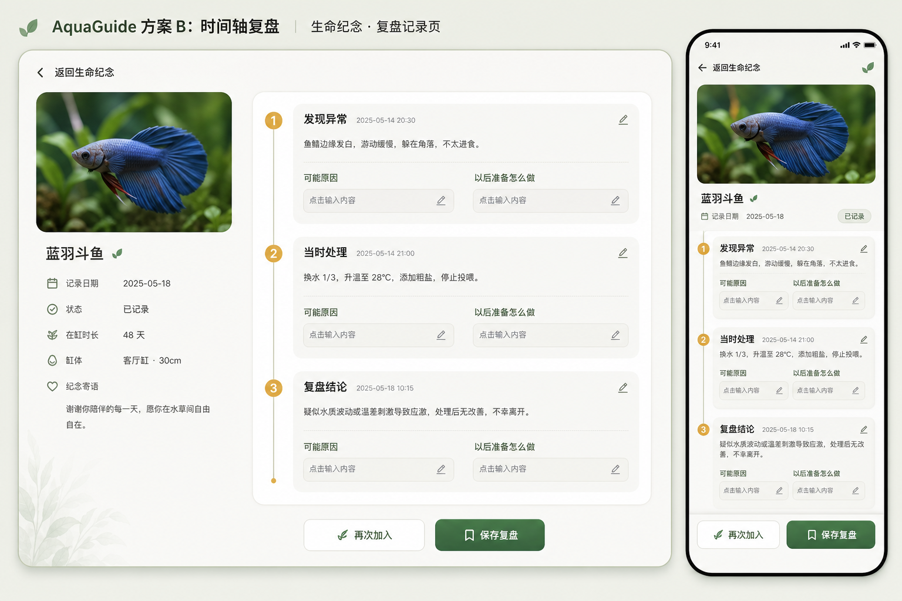
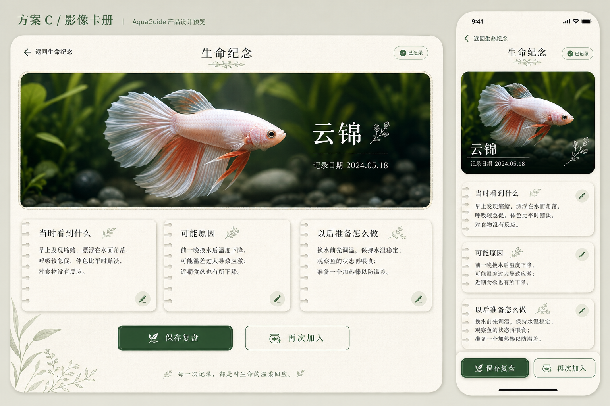

# 生命纪念独立详情页设计方案

状态：A「纪念档案」为当前实施基线。B、C 仅用于视觉方向对照，不进入正式路由。

## A「纪念档案」

- 物种主图与记录日期建立识别。
- “当时看到什么 / 可能原因 / 以后准备怎么做”直接呈现。
- 桌面双栏、手机单列，底部只保留“保存复盘”和次级“再次加入”。

## B「时间轴复盘」

- 按“发现异常 / 当时处理 / 复盘结论”组织时间线。
- 更适合有连续过程记录的场景，但第一版数据不足以稳定支持全部阶段。

## C「影像卡册」

- 图片占据更高视觉权重，复盘内容使用纸张式卡片。
- 情感表达更强，但会降低编辑效率并增加手机首屏高度。

## 实施约束

- 生命纪念详情使用正式路由，不使用内容弹窗。
- 只记录用户主动填写的结构化复盘，不由 AI 推断原因。
- 删除和放弃未保存修改使用确认弹窗；普通查看和编辑不增加弹窗层级。
- 旧记录缺失新增字段时安全显示空状态，并提供“补充复盘”。
